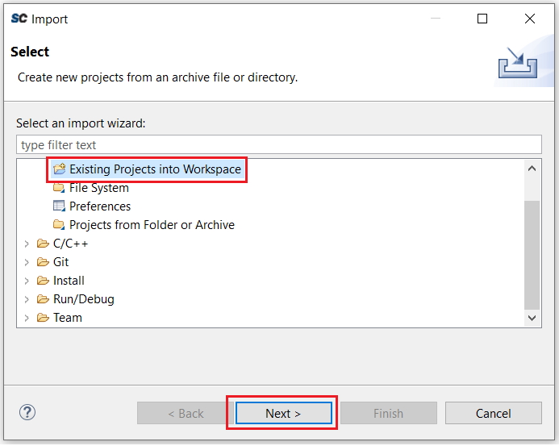
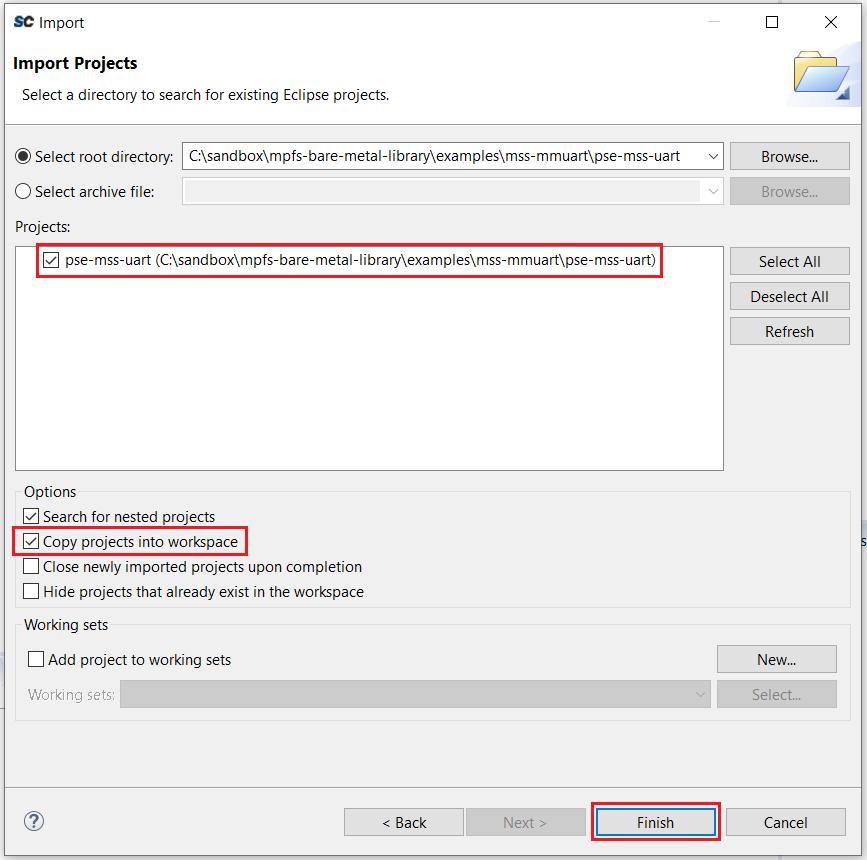
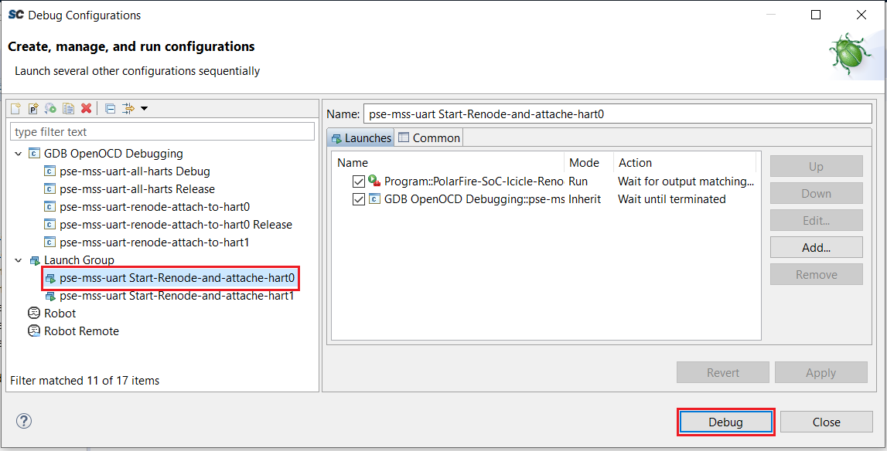
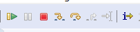

# Bare Metal Library Example Projects
This document describes how to use the SoftConsole example projects included in
the PolarFire SoC Bare Metal Library.

## Important Note About SoftConsole Workspace
SoftConsole includes an empty workspace. We recommend that you make a copy of
this empty workspace to a location of your choice. This will allow you to take
advantage of the integrated "develop and debug" perpective, Renode platform
launchers and other preconfigured settings.

Using the empty workspace as a starting point for your own workspace allows the
example projects to work out of the box. In particular the Renode debug launchers
included in the example projects will refer to the correct Renode external tool
launchers.

The empty workspace is located under the following path of your SoftConsole
installation:

    ./extras/workspace.empty

## Importing Example Projects Into Your SoftConsole Workspace
SoftConsole example projects are include in the following folder of the of the
Bare Metal Library: mpfs-bare-metal-library/examples

- Select the File->Import menu to import an example project into your SoftConsole
Workspace:

   

- Select "Existing Projects into Workspace" and click "Next":

   

- Select the folder inside the Bare Metal Library containing the example project
of your choice then click "Select Folder".

   Ensure that the project of your choice is listed and the box beside it ticked
in the "Projects" list. If the project does not show up in the list, it probably
means that you selected the incorrect folder level in the previous step.
Ensure the "Copy projects into workspace" option is ticked then click "Finish".

   

- The imported project now appears in the "Project Explorer":

   

## Executing/Debugging Examples In Renode
Most example projects include a Renode debug launcher allowing execution of the
example projects in the Renode virtual platform.

- Click on the down-arrow on the right of the "Debug" button then click on "Debug Configurations":

   

- Select a Renode launcher in the "Launch Group" list then click "debug":

   

- This will launch Renode and some Renode analyzers allowing you to interact with the executing example code:

   

- The debug perspective reflects the debug operations:

   

- The debug execution is controlled using the debug buttons:

   

